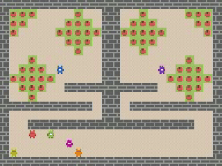

# Molten Pot


[](https://huggingface.co/datasets/jcformanek/moltenpot)

> **Offline RL meets social dilemmas.**
> Five mixed-motive substrates. Forty-seven scenarios. A terabyte of behavioural
> data. One reproducible pipeline.

> 📣 **Accepted as an oral presentation** at the ICML 2026 **DEMO** workshop
> (Decision-Making from Offline Datasets to Online Adaptation: Black-Box
> Optimization to Reinforcement Learning).
> Read the paper: <https://openreview.net/forum?id=0NYZ3Hkamd>

<p align="center">
  
  
  
  
  
</p>
<p align="center"><sub>End-of-training PPO rollouts on each of the five
mixed-motive substrates: <em>Clean Up</em>, <em>Coins</em>,
<em>Coop Mining</em>, <em>Commons Harvest</em>, <em>Allelopathic
Harvest</em>.</sub></p>

Molten Pot is an offline reinforcement-learning benchmark built on the
mixed-motive substrates from MeltingPot. It exists to make **social
offline RL reproducible end-to-end**: training and evaluating the four
canonical offline RL algorithms (BC, BCQ, IQL, CQL) across three
evaluation settings —

- **Setting 1.** Single-scenario offline RL.
- **Setting 2.** Multi-scenario offline RL with the scenario label withheld.
- **Setting 3.** Zero-shot social generalisation across disjoint train/test scenario splits.

---

## 🔭 Explore the benchmark in your browser

> ### **[👉 Open the interactive scenario browser →](https://jcformanek.github.io/moltenpot/)**
>
> See every scenario come to life. For each of the **47 scenarios**
> the live site shows
> a 🎬 **start-of-training rollout** alongside the
> 🏁 **end-of-training rollout** so you can *watch* the behaviour policy learn,
> a 📊 **return-distribution histogram** logged across PPO training, and
> a 📈 **Setting 1 vs Setting 2** comparison plot for the four offline-RL
> algorithms.
>
> A separate
> [**Setting 3 splits view**](https://jcformanek.github.io/moltenpot/splits.html)
> tiles all 18 train→test partitions as Train ↓ Test mosaics — the
> distribution shift each split is testing is visible at a glance.
>
> No install required — just point your browser at
> [`jcformanek.github.io/moltenpot`](https://jcformanek.github.io/moltenpot/).

---

<p align="center">
  <a href="https://huggingface.co/datasets/jcformanek/moltenpot">
    
  </a>
</p>
<p align="center">
  <strong>~1 TB</strong> of focal-agent trajectories — released on the
  Hugging Face Hub and <em>auto-downloaded the first time a training run needs them</em>:
  <a href="https://huggingface.co/datasets/jcformanek/moltenpot"><code>jcformanek/moltenpot</code></a>.
</p>

|   |   |
|---|---:|
| Substrates | **5** |
| Scenarios | **47** |
| Episodes | **~47,000** |
| Episode horizon | **1,000** timesteps |
| Focal-agent trajectories | **~186,000** |
| Focal-agent transitions | **~185 million** |
| Total size on disk | **~1 TB** |

<sub>Across 47 scenarios with 1–14 focal agents each, every episode is recorded
from every focal agent's perspective; trajectories are logged uniformly across
PPO training so each scenario's dataset is a skill-mixed cross-section from
random initialisation to the converged behaviour policy.</sub>

---

## Repository layout

```
moltenpot/
├── moltenpot/                    # core library
│   ├── model.py                  # MoltenpotAgent — CNN + GRU + Actor-Critic
│   ├── workers.py                # Ray actors: RolloutWorker, PPOLearner, HDF5Writer
│   ├── wrappers.py               # MeltingPotShimmy — Gym-style env adapter
│   ├── data_utils.py             # PyTorch Datasets streaming from HDF5
│   ├── hub.py                    # HuggingFace Hub auto-download
│   └── algorithms/
│       ├── bc.py                 # Behavioural Cloning
│       ├── bcq.py                # Batch-Constrained Q-Learning
│       ├── iql.py                # Implicit Q-Learning
│       ├── cql.py                # Conservative Q-Learning
│       └── eval_utils.py         # parallel multi-scenario evaluation
├── configs/
│   ├── train_ppo.yaml            # PPO data collection
│   ├── train_offline.yaml        # Offline RL training
│   ├── algorithm/{bc,bcq,iql,cql}.yaml
│   └── experiment/               # per-substrate / per-split training configs
├── scripts/
│   ├── train_ppo.py              # online PPO data collection
│   ├── train_offline.py          # offline RL training entry point
│   └── download_datasets.py      # bulk-download from the Hub before training
└── tests/                        # model + env-wrapper unit tests
```

---

## Installation

We use [`uv`](https://docs.astral.sh/uv/) for environment and package
management. If you don't already have it installed:

```bash
curl -LsSf https://astral.sh/uv/install.sh | sh
```

Then create a Python 3.11 environment (matching the pin in
`pyproject.toml`) and install the package:

```bash
uv venv --python 3.11
source .venv/bin/activate
uv pip install -e .
```

This pulls a CPU-friendly PyTorch by default. To use a GPU, install a
CUDA-matching PyTorch wheel afterwards — see
<https://pytorch.org/get-started/locally/> for the right wheel URL,
e.g.:

```bash
uv pip install --upgrade torch --index-url https://download.pytorch.org/whl/cu128
```

You will additionally need the official MeltingPot package (the env
wrappers in `moltenpot/wrappers.py` import from it lazily):

```bash
uv pip install dm-meltingpot
```

---

## Reproducing the paper's results

### 1. Train an offline RL algorithm on a single scenario (Setting 1)

```bash
python scripts/train_offline.py \
    algorithm=iql \
    substrate=clean_up \
    train_mode=clean_up_0 \
    in_dist_scenarios='[clean_up_0]' \
    out_dist_eval=false \
    data_root=data/clean_up \
    seed=1
```

The dataset is auto-downloaded from `jcformanek/moltenpot` on first use.

### 2. Train across all scenarios in a substrate (Setting 2)

```bash
python scripts/train_offline.py \
    +experiment=benchmark_coins_ALL \
    algorithm=iql \
    seed=1
```

### 3. Train on a held-out split (Setting 3)

```bash
python scripts/train_offline.py \
    +experiment=benchmark_clean_U1 \
    algorithm=cql \
    seed=1
```

The 18 splits referenced in the paper are defined in
`configs/experiment/benchmark_*.yaml`.

### Reproducing a whole setting with W&B sweeps

To launch every run behind a setting at once, use the ready-made sweep
configs in `sweeps/<substrate>/setting{1,2,3}.yaml`. Each grids over the
four algorithms × three seeds:

```bash
wandb sweep sweeps/coins/setting1.yaml   # prints a <sweep_id>
wandb agent <entity>/<project>/<sweep_id>
```

Point any number of agents at the same `<sweep_id>` to parallelise across
machines. Run counts per sweep:

| Substrate | Setting 1 | Setting 2 | Setting 3 | Total |
|---|--:|--:|--:|--:|
| Allelopathic Harvest | 156 | 12 | 48 | 216 |
| Commons Harvest | 144 | 12 | 48 | 204 |
| Clean Up | 108 | 12 | 36 | 156 |
| Coins | 84 | 12 | 48 | 144 |
| Coop Mining | 72 | 12 | 36 | 120 |

<sub>Setting 1 = single-scenario (one run per scenario), Setting 2 =
multi-scenario union, Setting 3 = held-out train→test splits; each cell is
4 algorithms × 3 seeds × the relevant scenario/split count.</sub>

---

## Running the test suite

```bash
uv pip install -e ".[dev]"
pytest tests/
```

---

## Notes on Weights & Biases

The training scripts log to W&B by default. You can either:

- export `WANDB_MODE=offline` to skip the login step, or
- pass `wandb.enabled=false` on the command line, or
- log in with your own W&B account; no shared project credentials are
  required.

---

## Re-collecting a dataset (optional)

If you want to regenerate any per-scenario dataset from scratch via
independent PPO instead of downloading it from the Hub:

```bash
python scripts/train_ppo.py \
    substrate=clean_up \
    scenarios=clean_up_0 \
    num_actors=8 \
    total_steps=10_000_000 \
    output=data/clean_up/clean_up_0/dataset.hdf5
```

This is not required to reproduce any of the offline-RL training
results — those auto-download the released datasets from the Hub.

---

## License

- **Code** — MIT License (see [`LICENSE`](LICENSE)).
- **Datasets** — Creative Commons Attribution 4.0 (CC-BY-4.0); see
  [`LICENSE-DATA`](LICENSE-DATA).

Dataset documentation following the *Datasheets for Datasets* framework is in
[`DATASHEET.md`](DATASHEET.md).
